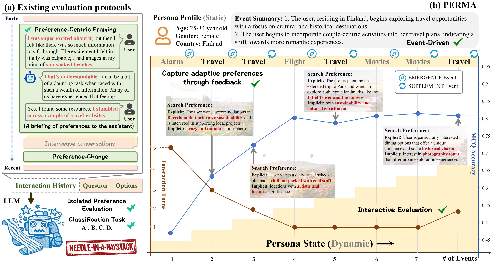

# PrefEvolve: Tracking the Evolving Self in Event-Driven Persona States for Personalized Memory

Official codebase of the **PrefEvolve benchmark**, designed to evaluate whether memory-augmented agents can track, update, and apply evolving user preferences across long-horizon interactions.

## ✨ Why PrefEvolve

PrefEvolve models preference understanding as an **event-driven temporal process**:

- preferences are revealed gradually through user feedback rather than given explicitly
- user constraints can conflict across sessions
- agents must recover relevant memory under noisy, realistic dialogue

## 🔍 Research Questions

PrefEvolve focuses on three core questions:

1. Can a system recover user-specific preferences from long interaction histories?
2. Can it track how preferences evolve after emergence and supplement events?
3. Can it generate responses consistent with updated persona states in new tasks?

## 🧩 Benchmark Highlights

- **Event-driven personalization** through multi-session interaction timelines
- **Implicit preference extraction** from natural task-oriented dialogue
- **Robust query settings** with in-session perturbations and style variation
- **Cross-framework evaluation** for memory systems under a unified protocol

Supported memory frameworks: `Mem0`, `MemOS`, `Memobase`, `Supermemory`, `Lightmem`, `EverMemOS`

## 🧪 Benchmark Design

### 1) Event-Driven Persona Construction

Each user is represented by a timeline of sessions derived from persona profiles and interaction summaries. During each session, users may:

- issue goal-oriented requests
- provide correction feedback
- refine constraints and preferences

Preference evolution is modeled with two event types:

- **Emergence**: introduces a new preference signal
- **Supplement**: updates or sharpens existing preference signals
