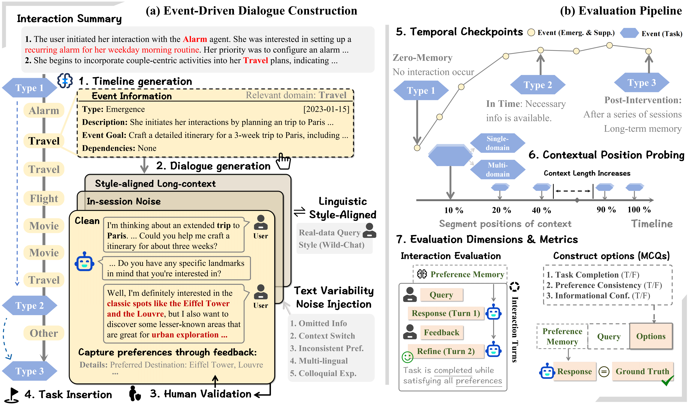
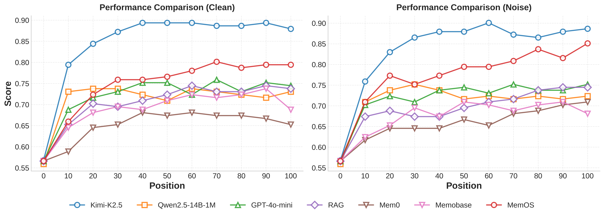

# PERMA: Benchmarking Personalized Memory Agents via Event-Driven Preference and Realistic Task Environments

[](https://arxiv.org/abs/2603.23231)
[](https://huggingface.co/datasets/ustclsc/PERMA)
[](https://opensource.org/licenses/Apache-2.0)
[](https://www.python.org/downloads/)

Codebase for the **PERMA benchmark**. PERMA is designed to evaluate whether memory system-based agents can identify, integrate, and maintain user preferences across long-horizon, multi-domain, and realistic interactions.

<p align="center"></p>

## 🌟 Overview

We propose **PERMA**, a benchmark that shifts from evaluating static retrieval to **event-driven preference evolution** in realistic task environments. By testing models through both multiple-choice and interactive tasks, we evaluate persona consistency across temporally ordered, noisy interactions. Our findings reveal that while current memory systems reduce costs, maintaining a coherent persona across temporal depth and domain shifts remains a major challenge.

## 📰 News

- **2026.03.24**: Our paper was released on arXiv: [PERMA](https://arxiv.org/abs/2603.23231).
- **2026.03.28**: The PERMA dataset was released on Hugging Face: [ustclsc/PERMA](https://huggingface.co/datasets/ustclsc/PERMA).


## 🎯 Benchmark Highlights

- **Event-Driven Personalization**: Multi-session and multi-domain interaction timelines where preferences emerge and evolve.
- **Realistic Query Noise**: Text variability (omitted info, context switching).
- **Linguistic Style-Aligned**: Individual idiolects inspired by realistic user-assistant interaction datasets.
- **Cross-Framework Evaluation**: A unified evaluation protocol supporting various memory systems.


## 📊 Evaluation Protocols

### A. Multiple-Choice Evaluation
Options evaluate granular cognitive capabilities across three dimensions:
- **Task Completion**, indicating the fulfillment of defined goals.
- **Preference Consistency**, ensuring responses are grounded in long-term preferences without hallucinating unsupported inferences.
- **Informational Confidence**, identifying whether the model maintains a decisive stance without uncertainty

### B. Interactive Evaluation
An LLM-based user simulator interacts with the personalized memory agents, closing the conversation if preferences are met, or otherwise providing supplementary information to mimic a human correcting the agent:
- Gold Dialogue history is visible to the user simulator.
- Core metrics include **Turn-1** and **Turn-2 Success Rate**.

We conduct probing evaluations at various temporal intervals along the dialogue timeline to examine how performance changes as persona states accumulate and potentially drift. 

---

## 🏆 Experimental Results

The performance of all evaluated approaches across single-domain and multi-domain tasks, under both Clean and Noise scenarios, is summarized below.

We analyze persona consistency across temporal depth and compare different models and memory systems from multiple perspectives, including:

- **MCQ Acc.** — task accuracy  
- **BERT-F1, Memory Score** — memory fidelity  
- **Search Tokens, Search Duration** — search efficiency  
- **Completion, User Tokens, Turn = 1, Turn ≤ 2** — interactive success rates  

<details>
<summary>Detailed Results</summary>


### A. Standalone LLMs (MCQ Acc.)

| Model              | Clean, Single-Domain | Noise, Single-Domain | Clean, Multi-Domain | Noise, Multi-Domain |
|--------------------|-------------|--------------|-------------|-------------|
| **Reasoning Models** ||||| 
| MiniMax-M2.5       | 0.797       | 0.797        | 0.86        | 0.866       |
| GLM-5              | 0.811       | 0.813        | 0.885       | 0.905       |
| Kimi-K2.5          | 0.882       | 0.865        | 0.955       | 0.93        |
| **Chat Models**    ||||| 
| Qwen3-32B          | 0.87        | 0.877        | 0.936       | 0.93        |
| Qwen2.5-72B        | 0.79        | 0.792        | 0.815       | 0.841       |
| Qwen2.5-14B-1M     | 0.759       | 0.766        | 0.873       | 0.841       |
| Llama3.3-70B       | 0.818       | 0.82         | 0.682       | 0.656       |
| Gemini2.5-Flash    | 0.87        | 0.879        | 0.898       | 0.93        |
| GLM-4.7-Flash      | 0.868       | 0.853        | 0.828       | 0.841       |
| GPT-4o-mini        | 0.78        | 0.766        | 0.707       | 0.72        |

### B. Memory Systems

#### Clean, Single-domain tasks

| Baseline        | MCQ Acc. | BERT-f1 | Memory Score | Context Token | Search Duration | Completion | User Token | Turn=1 | Turn≤2 |
|-----------------|----------|---------|--------------|------------------|-----------------|------------|---------------|--------|--------|
| RAG (BGE-M3)    | 0.702    | 0.859   | 1.89         | 928.8            | 16.2            | 0.83       | 61.9          | 0.461  | 0.797  |
| MemOS           | 0.811    | 0.83    | 2.27         | 709.1            | 369.1           | 0.842      | 60.7          | 0.548  | 0.801  |
| Mem0            | 0.686    | 0.781   | 1.91         | 340.1            | 557             | 0.797      | 69.4          | 0.475  | 0.775  |
| Lightmem        | 0.657    | 0.792   | 1.83         | 297.3            | 8.5             | 0.794      | 62.3          | 0.532  | 0.813  |
| Memobase        | 0.733    | 0.781   | 1.86         | 1033.3           | 1991            | 0.804      | 59.2          | 0.504  | 0.83   |
| EverMemOS       | 0.728    | 0.827   | 2.08         | 3230.5           | 16666.5         | 0.846      | 60            | 0.508  | 0.79   |
| Supermemory     | 0.655    | 0.799   | 1.84         | 94.3             | 2881.7          | 0.804      | 65.9          | 0.501  | 0.804  |

#### Noise, Single-domain tasks

| Baseline        | MCQ Acc. | BERT-f1 | Memory Score | Context Token | Search Duration | Completion | User Token | Turn=1 | Turn≤2 |
|-----------------|----------|---------|--------------|------------------|-----------------|------------|---------------|--------|--------|
| RAG (BGE-M3)    | 0.719    | 0.852   | 1.92         | 933.4            | 16.9            | 0.811      | 60.9          | 0.466  | 0.787  |
| MemOS           | 0.853    | 0.844   | 2.38         | 1486.7           | 644.5           | 0.837      | 56.9          | 0.567  | 0.837  |
| Mem0            | 0.66     | 0.779   | 1.87         | 337.1            | 492.6           | 0.818      | 68.7          | 0.47   | 0.754  |
| Lightmem        | 0.671    | 0.791   | 1.88         | 292.9            | 8               | 0.82       | 61.4          | 0.52   | 0.806  |
| Memobase        | 0.683    | 0.772   | 1.87         | 1061             | 1721.5          | 0.785      | 61.2          | 0.551  | 0.787  |
| EverMemOS       | 0.695    | 0.824   | 2.09         | 3177.8           | 19246.9         | 0.811      | 60.4          | 0.489  | 0.773  |
| Supermemory     | 0.674    | 0.796   | 1.96         | 92.6             | 3883.6          | 0.806      | 62            | 0.501  | 0.811  |

#### Clean, Multi-domain tasks

| Baseline        | MCQ Acc. | BERT-f1 | Memory Score | Context Token | Search Duration | Completion | User Token | Turn=1 | Turn≤2 |
|-----------------|----------|---------|--------------|------------------|-----------------|------------|---------------|--------|--------|
| RAG (BGE-M3)    | 0.682    | 0.849   | 1.78         | 858.1            | 16.5            | 0.745      | 122.6         | 0.204  | 0.561  |
| MemOS           | 0.732    | 0.819   | 2.14         | 664.7            | 364.2           | 0.643      | 113.3         | 0.306  | 0.592  |
| Mem0            | 0.65     | 0.785   | 1.78         | 339.5            | 525.3           | 0.694      | 129.7         | 0.28   | 0.529  |
| Lightmem        | 0.605    | 0.795   | 1.78         | 289.9            | 8.5             | 0.643      | 129.2         | 0.274  | 0.58   |
| Memobase        | 0.694    | 0.793   | 1.71         | 1033.2           | 2228            | 0.65       | 102.4         | 0.331  | 0.656  |
| EverMemOS       | 0.713    | 0.82    | 1.98         | 3134.4           | 15847           | 0.688      | 115.2         | 0.268  | 0.573  |
| Supermemory     | 0.656    | 0.803   | 1.72         | 92.4             | 3232.3          | 0.675      | 125.4         | 0.248  | 0.554  |


#### Temporal Depth
Below is MCQ Acc. across three evaluation checkpoints in the single-domain, Clean setting.
- **Type 1 (Zero-Memory)**: Evaluated at the onset of user interaction before relevant preferences are established.
- **Type 2 (In-Time)**: Positioned immediately after all relevant sessions have occurred.
- **Type 3 (Post-Intervention)**: Positioned after a series of sessions containing unrelated topics.

<p align="center">
  
  
</p>

We further evaluate the MCQ Acc. performance trends of different approaches across varying segment positions in single-domain tasks under both Clean and Noisy settings.

<p align="center"></p>
</details>


## ⚙️ Dependencies

**1. Clone the repository and install dependencies**
```bash
git clone https://github.com/PolarisLiu1/PERMA
cd PERMA

conda create -n perma python=3.11
conda activate perma

pip install -r requirements.txt
```

**2. Download the PERMA dataset**

```bash
# Install Hugging Face Hub CLI if needed
pip install -U "huggingface_hub[cli]"

# Download dataset files to a temporary local directory
huggingface-cli download ustclsc/PERMA --repo-type dataset --local-dir ./data --resume-download
```

**3. Configure API Keys**
Create a `.env` file in the `code/src` directory:

```env
# code/src/.env
CHAT_MODEL=gpt-4o-mini
CHAT_MODEL_API_KEY=your_openai_api_key
CHAT_MODEL_BASE_URL=your_api_base_url
MEMOS_KEY=your_memos_key
# Add other backend keys based on the memory systems you intend to evaluate
```


## 🚀 Quick Start

### 1: Run Evaluation

Evaluate a memory framework (e.g., `MemOS`) on the generated data across different temporal depths (Type 1/2/3). 
- `--stage` argument allows you to run specific parts of the pipeline. 
- `--multi_domain`: `True`=multi-domain, `False`=single-domain.
- `--interactive True`: enable interactive evaluation.
- `--no_noise`: controls noise (`True`=clean, `False`=noisy); for style alignment use `--style True`.
- `--mode`: retrieval/evaluation framework selector (`memory`, `rag`, `standalone`).
- `--incremental`: protocol switch (`False`=standard evaluation, `True`=incremental timeline evaluation).

**Smoke Test:**
Use limited data for testing to ensure everything is normal. Default: 1 user, first 5 questions.

```bash
cd code/src
python evaluation.py \
  --mode memory \
  --incremental false \
  --mem_frame memos-api-online \
  --stage add search answer eval \
  --smoke_test \
  --output_dir ../../data/evaluation \
  --top_k 10
```

**Standard Evaluation:**

```bash
cd code/src
python evaluation.py \
  --mode memory \
  --incremental false \
  --mem_frame memos-api-online \
  --stage add search answer eval \
  --output_dir ../../data/evaluation \
  --top_k 10 \
  --multi_domain False \
  --interactive True \
  --no_noise True
```

*Available `--mode` options: `memory`, `rag`, `standalone`.*

**Incremental Evaluation:**
Set `--incremental true` to evaluate results at different timeline positions.
In this protocol:
- `--dataset_type standard`: standard incremental data (clean/noisy/style variants, controlled by `--no_noise` and `--style`).
- `--dataset_type long` / `--dataset_type long_multi`: WildChat-style long-context incremental data.

```bash
cd code/src
python evaluation.py \
  --mode memory \
  --incremental true \
  --mem_frame memos-api-online \
  --dataset_type standard \
  --stage add search answer eval \
  --output_dir ../../data/evaluation
```

*Available `--dataset_type` options: `standard`, `long`, `long_multi`.*


### 2. Run via Bash Scripts:

Scripts are located in:
```
- `code/scripts/run_smoke_tests.sh`
- `code/scripts/run_standard_tests.sh`
```

### 3. Generate Dialogues (Additional)

PERMA is constructed based on seed datasets, making it highly extensible. If you want to expand the dataset for training purposes, such as generating more dialogue data, you can easily do so.


```bash
cd code/src
python complete_dataset_generator.py \
  --output_dir ../../data/tasks/generated_datasets \
  --topic_number 3 \
  --multi_domain False
```

*Optional generation modes:*

- `--regenerate_clean`: Generate clean data without injected noise.
- `--style_transfer --wildchat_dir WildChat-1M`: Apply WildChat conversational style.


## 📝 Citation
```bibtex
@misc{liu2026permabenchmarkingpersonalizedmemory,
      title={PERMA: Benchmarking Personalized Memory Agents via Event-Driven Preference and Realistic Task Environments}, 
      author={Shuochen Liu and Junyi Zhu and Long Shu and Junda Lin and Yuhao Chen and Haotian Zhang and Chao Zhang and Derong Xu and Jia Li and Bo Tang and Zhiyu Li and Feiyu Xiong and Enhong Chen and Tong Xu},
      year={2026},
      eprint={2603.23231},
      archivePrefix={arXiv},
      primaryClass={cs.AI},
      url={https://arxiv.org/abs/2603.23231}, 
}
```
